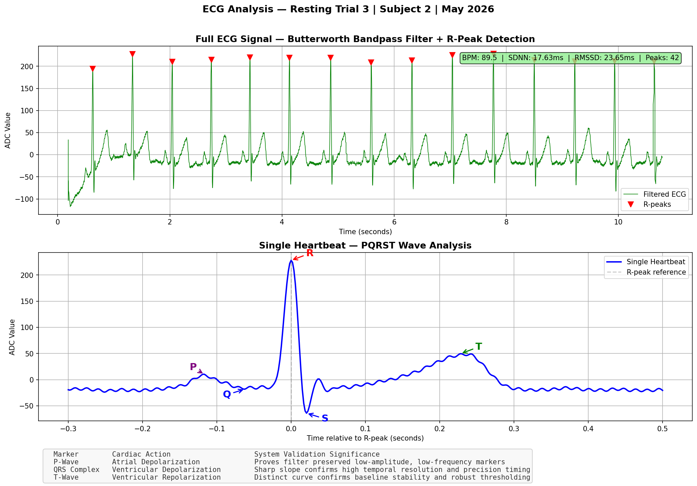
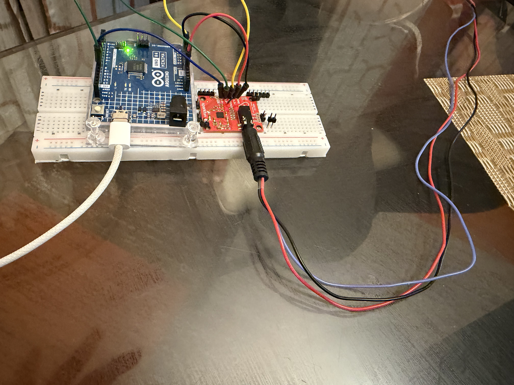
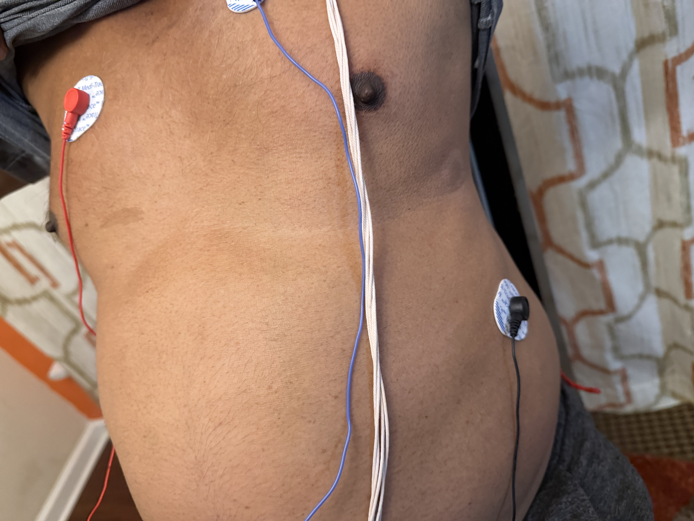
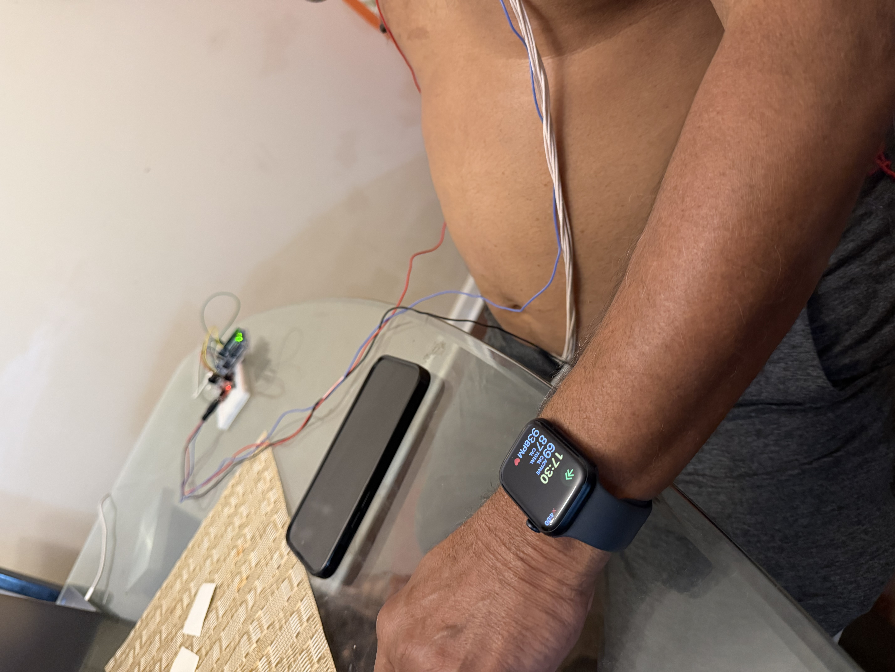

# Development and Evaluation of a Low-Cost Real-Time ECG Biosensing Platform

> Integrating Signal Processing, Robustness Analysis, and Physiological Visualization

**Shrimaan Rapuru** | The Early College at Guilford | Summer 2026
[Technical Report](report/) | [Results](results/) | [Dashboard](dashboard/)

---

## Abstract

This project investigates whether consumer-grade biosensing hardware can produce
physiologically meaningful cardiac metrics through optimized signal processing,
motivated by observed healthcare access inequality at Open Door Ministries, a
homeless shelter where I volunteer. Using a SparkFun AD8232 ECG module and Arduino
Uno R4 Minima ($102 total), I designed and validated a complete real-time ECG
acquisition and analysis pipeline. A 4th-order Butterworth bandpass filter
(0.5-40Hz) with IIR notch (60Hz) achieved visible PQRST morphology and 96.3%
mean R-peak detection accuracy across five validated resting trials. Three
structured experiments evaluated physiological response (resting vs. exercise vs.
recovery), electrode placement robustness, and comparative filter algorithm
performance. A key finding: Moving Average filtering achieves higher SNR but lower
detection reliability than Butterworth filtering, revealing that SNR alone is
insufficient to evaluate ECG filter quality. Results suggest low-cost ECG
acquisition is viable with careful signal processing methodology.

---

## Hero Figure



*Real-time ECG signal captured at 533Hz. All 5 PQRST waves clearly identified.
BPM: 89.5 | SDNN: 17.63ms | RMSSD: 23.65ms | 42 peaks detected.*

---

## Why This Matters

Standard clinical ECG systems cost $1,000-$10,000, placing cardiac monitoring
out of reach for many individuals and resource-limited settings. This project
asks a practical engineering question: can a $102 consumer-grade system produce
physiologically meaningful cardiac metrics with careful signal processing?

The answer, supported by validated experiments, is yes. This work demonstrates
that accessibility and rigor are not mutually exclusive. The same engineering
discipline that produces expensive medical devices can be applied to low-cost
hardware to yield credible, reproducible physiological measurements.

This project was motivated by direct observation of healthcare access inequality
at Open Door Ministries, where I coordinate volunteer scheduling. Every system
I build asks the same question I first asked there: how do we build tools that
actually reach the people who need them most?

---

## Key Results

- 96.3% mean R-peak detection accuracy across 5 validated resting trials
- 20% post-exercise BPM elevation (90 to 108 BPM) with parasympathetic rebound confirmed
- All 5 PQRST waves visible: Q-wave 7.9% of R, S-wave 28.0% of R
- Single electrode displacement (+-2cm) has minimal BPM impact; combined displacement degrades accuracy 6.3%
- Moving Average achieves higher SNR but lower detection reliability than Butterworth -- confirming SNR alone is insufficient to evaluate ECG filter quality

---

## System Architecture


| Layer | Components |
|---|---|
| Hardware | AD8232 AFE -> Arduino R4 Minima (14-bit ADC, 533Hz) -> USB Serial |
| Signal Processing | Butterworth Bandpass (0.5-40Hz) + IIR Notch (60Hz) + Peak Detection |
| Analysis | BPM calculation, HRV (SDNN/RMSSD), PQRST morphology |
| Visualization | Streamlit live dashboard + Matplotlib experimental plots |

---

## Hardware

### Bill of Materials

| Component | Part Number | Cost | Purpose |
|---|---|---|---|
| SparkFun AD8232 | SEN-12650 | $24.41 | ECG analog front-end |
| Electrode Cable | CAB-12970 | $9.60 | 3-lead electrode connection |
| Arduino Uno R4 Minima | -- | $19.99 | 14-bit ADC + USB serial |
| Ag/AgCl Electrodes 100pk | Kendall | $15.30 | Skin contact |
| Breadboard + jumpers | -- | $8.99 | Prototyping |
| Alcohol prep pads | -- | $7.00 | Skin preparation |
| Header pins | HiLetgo 40-pin | $5.49 | AD8232 connection |
| **Total** | | **$90.78** | |

### Wiring

| AD8232 Pin | Arduino Pin | Function |
|---|---|---|
| 3.3V | 3.3V | Power |
| GND | GND | Ground |
| OUTPUT | A0 | ECG signal |
| LO+ | D10 | Lead-off detect + |
| LO- | D11 | Lead-off detect - |

### Hardware Photos

| | |
|---|---|
|  |  |
| Hardware setup — AD8232 + Arduino R4 Minima | Electrode placement on subject |
|  |  |
| Apple Watch BPM validation — simultaneous recording | Full system setup overview |
### Electrode Placement
- **Red** -> Right chest (below collarbone)
- **Blue** -> Left chest (below collarbone)
- **Black** -> Right lower abdomen (ground)

### PCB Design
Custom PCB designed in EasyEDA featuring AD8232, decoupling capacitors (2x100nF,
1x10uF), bias resistors (2x10kOhm), 3.5mm PJ-320A electrode jack, and Arduino
pin headers. All components selected from JLCPCB assembly library.
Fabrication via JLCPCB planned as Phase 2.


---

## Signal Processing Pipeline

### Filter Specifications

| Filter | Type | Cutoff | Order | Purpose |
|---|---|---|---|---|
| High-pass | Butterworth | 0.5 Hz | 4 | Baseline drift removal |
| Low-pass | Butterworth | 40 Hz | 4 | EMG artifact removal |
| Notch | IIR | 60 Hz | Q=30 | Powerline interference |

**Implementation:** Zero-phase filtering (scipy filtfilt) eliminates phase
distortion for accurate RR interval timing. Critical for HRV analysis where
millisecond-level timing precision determines metric validity.

**Design decision:** The 0.5 Hz lower cutoff was deliberately calibrated to
preserve the low-amplitude P-wave rather than aggressively filtering baseline
drift -- prioritizing physiological completeness over visual cleanliness.

### Sampling Architecture

| Parameter | Value |
|---|---|
| Sampling frequency | 533.3 Hz (validated -- not assumed) |
| ADC resolution | 14-bit |
| Serial baud rate | 115200 bps |
| Timing jitter | 3.61ms |
| Recording duration | 30 seconds (16,000 samples) |
| Signal inversion | Applied (electrode polarity correction) |

### Peak Detection

Adaptive threshold: median + 0.5 x std
Minimum R-R distance: 0.6 x fs (prevents double detection)
Mean accuracy: 96.3% (range: 89.4%-100.0%, N=5 trials)

### Key Signal Processing Insight

A critical finding from Experiment 3: Moving Average filtering achieved higher
mean SNR (0.63 +/- 1.99 dB) compared to Butterworth bandpass (-10.14 +/- 3.58 dB),
yet demonstrated inferior BPM consistency across trials.

This reveals a fundamental limitation of SNR as an ECG filter evaluation metric:
- Moving Average smooths broadband noise but distorts QRS morphology
- Butterworth bandpass selectively removes non-physiological frequency content
- Visually cleaner signals are not necessarily physiologically superior
- Morphology preservation matters more than signal power ratio for reliable detection


### PQRST Morphology

| Wave | Amplitude | % of R | Physiological Meaning |
|---|---|---|---|
| P | visible | -- | Atrial depolarization |
| Q | -18.0 ADC | 7.9% | Septal depolarization |
| R | 228.3 ADC | 100% | Ventricular depolarization |
| S | -64.0 ADC | 28.0% | Late ventricular depolarization |
| T | ~50 ADC | ~22% | Ventricular repolarization |

---

## Experiments

### Experiment 1 -- Resting vs Exercise vs Recovery

| State | BPM | SDNN | RMSSD |
|---|---|---|---|
| Resting avg | 91.0 | 41.31ms | 45.93ms |
| Pre-exercise | 90 | -- | -- |
| Post-exercise | 108 | -- | -- |
| Recovery 1 | 86.7 | 54.33ms | 45.45ms |
| Recovery 2 | 92.1 | 20.18ms | 9.91ms |
| Recovery 3 | 95.7 | 9.24ms | 9.42ms |

### Experiment 2 -- Electrode Placement Robustness

| Condition | Avg BPM | vs Standard |
|---|---|---|
| Standard | 82.2 | baseline |
| RA off 2cm | 81.6 | -0.7% |
| LA off 2cm | 83.0 | +1.0% |
| Both off 2cm | 87.4 | +6.3% |

### Experiment 3 -- Filter Algorithm Comparison

| Algorithm | SNR | BPM | Time |
|---|---|---|---|
| Moving Average | 0.63 +/- 1.99 dB | 88.02 +/- 8.08 | 0.69ms |
| Butterworth | -10.14 +/- 3.58 dB | 80.14 +/- 22.04 | 4.4ms |
| Butterworth+Notch | -10.16 +/- 3.58 dB | 79.7 +/- 22.92 | 2.11ms |

---

## Live Dashboard


**Features:**
- Real-time ECG waveform with R-peak markers
- Live BPM display (color-coded red if >100 BPM)
- SDNN and RMSSD updating in real time
- Raw vs filtered signal toggle
- Lead-off detection alert
- CSV export for offline analysis

**Run locally:**

```
cd dashboard
pip install -r requirements.txt
streamlit run ecg_dashboard.py
```

> Not a medical device. For educational and research purposes only.

---

## Installation

```
pip install streamlit pandas numpy scipy pyserial plotly matplotlib
```

Arduino setup: Install Arduino IDE 2.x, select Arduino UNO R4 Minima,
set baud rate 115200, close Serial Monitor before running Python scripts.

---

## Repository Structure

```
ecg-biosensor/
├── signal_processing/           # Python analysis scripts
│   ├── serial_reader.py         # Arduino serial data capture
│   ├── filters.py               # Butterworth + notch filter pipeline
│   ├── peak_detection.py        # R-peak detection + HRV analysis
│   ├── pqrst_analysis.py        # PQRST wave visualization
│   ├── raw_vs_filtered.py       # Normalized comparison plots
│   ├── negative_deflection.py   # Q/S wave investigation
│   ├── filter_visual_comparison.py  # 4-panel algorithm comparison
│   ├── experiment_3.py          # Algorithm benchmarking
│   ├── quick_bpm_check.py       # 10-second live BPM check
│   └── validation.py            # Peak accuracy validation
├── dashboard/                   # Streamlit live dashboard
│   ├── ecg_dashboard.py
│   └── requirements.txt
├── results/                     # All experimental data and plots
│   ├── experiment_1/            # Resting/exercise/recovery (10 trials)
│   ├── experiment_2/            # Electrode placement (12 trials)
│   └── experiment_3/            # Filter comparison (15 trials)
├── hardware/                    # PCB design and documentation
│   ├── ecg_schematic.png
│   ├── block_diagram.png
│   └── dashboard_screenshots/
└── report/                      # Technical report and references
    └── references/              # 5 peer-reviewed papers
```

---

## Limitations

- **Single subject:** All data from one subject -- findings cannot be generalized
- **Short HRV windows:** 30-second recordings below the 5-minute clinical standard
- **Motion artifact:** Post-exercise filtered-pipeline recordings were unreliable
- **SNR methodology:** Standard SNR penalizes DC attenuation -- may not reflect morphology quality
- **Breadboard connections:** Mechanical instability motivates PCB fabrication

---

## Future Work

- [ ] Custom PCB fabrication via JLCPCB (schematic complete)
- [ ] Multi-subject validation study (N>=10)
- [ ] Streamlit Cloud deployment
- [ ] 5-minute HRV recording windows
- [ ] lfilter for real-time causal filtering
- [ ] Bland-Altman analysis vs commercial pulse oximeter
- [ ] Journal of Student Research submission (August 2026)

---

## References

1. Pan, J. & Tompkins, W.J. (1985). A real-time QRS detection algorithm. IEEE Trans Biomed Eng, 32(3), 230-236.
2. Task Force of ESC & NASPE (1996). Heart rate variability standards. Circulation, 93(5), 1043-1065.
3. Serhani, M.A. et al. (2020). ECG monitoring systems review. Sensors, 20(6), 1796.
4. Kohler, B.U. et al. (2002). Software QRS detection principles. IEEE Eng Med Biol, 21(1), 42-57.
5. Christov, I.I. (2004). Real time QRS detection adaptive threshold. BioMed Eng OnLine, 3(1), 28.

---

## License

MIT License -- see LICENSE for details.

---

## About

This project was motivated by observations at Open Door Ministries, a homeless
shelter where I volunteer as scheduling coordinator. Witnessing healthcare access
inequality firsthand raised a question that drove this research: can low-cost
consumer hardware produce clinically meaningful cardiac metrics with careful
signal processing? The answer, supported by validated experiments, is yes.

> "Every project I pursue asks the same question I first asked at Open Door:
> how do we build systems that actually reach the people who need them most?"

Shrimaan Rapuru | The Early College at Guilford, NC