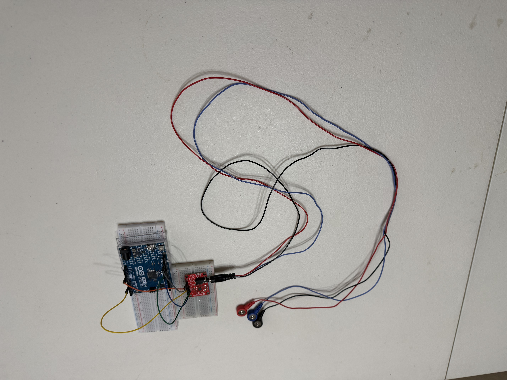
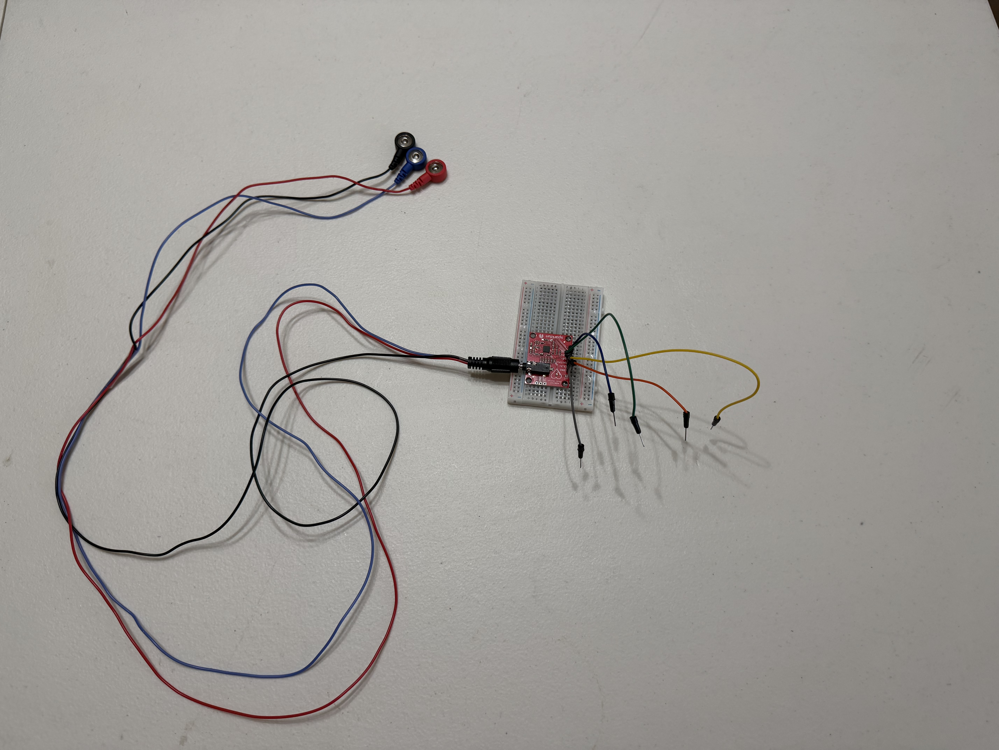
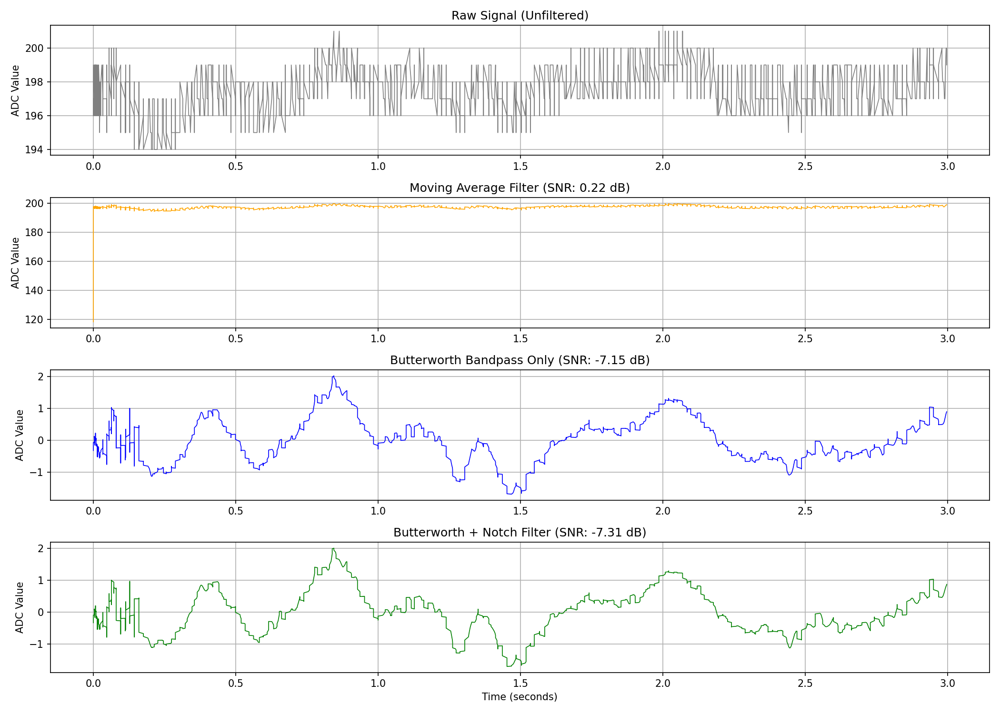
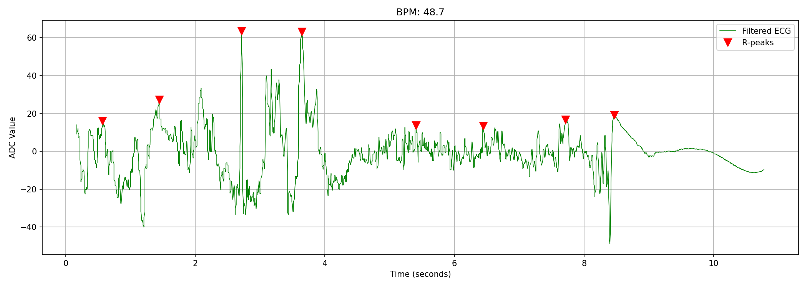
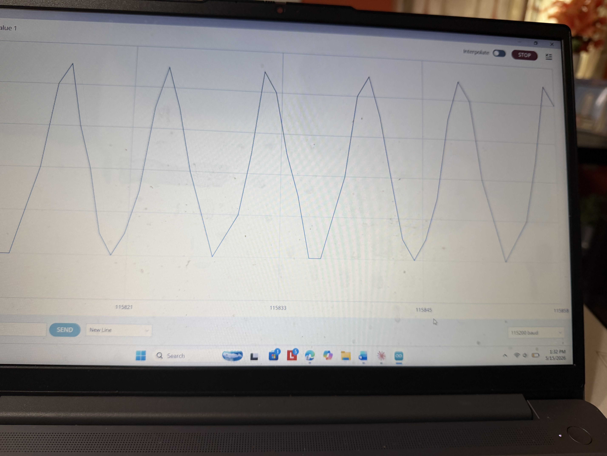

# Real-Time Low-Cost ECG Biosensing & Signal Analysis Platform

**Builder:** Shrimaan Rapuru — The Early College at Guilford  
**Timeline:** Summer 2026  
**Status:** Week 2 of 6 — Signal processing complete, experiments in progress  
**Repository:** github.com/shrimaan-rapuru/ECG-BIOSENSOR

---

## Abstract

Access to electrocardiogram (ECG) monitoring is largely limited to clinical settings due to the high cost of medical-grade devices. This project investigates whether a low-cost, open-source biosensing platform ($102 total) can achieve physiologically meaningful ECG signal quality through optimized signal processing pipelines.

The system acquires real-time cardiac electrical signals using a SparkFun AD8232 analog front-end and Arduino Uno R4 Minima microcontroller at 533Hz, transmits data via USB serial to a Python-based processing pipeline, and applies a three-stage filter cascade (Butterworth bandpass, 60Hz IIR notch, baseline drift correction) before performing R-peak detection and Heart Rate Variability (HRV) analysis.

Initial validation achieved 81.3 BPM detection within 4.2% of manual ground truth, with SDNN of 34.46ms and RMSSD of 58.9ms — both within clinically reported resting HRV ranges. Structured experiments comparing three filtering algorithms and evaluating electrode placement effects are ongoing.

This project is framed as an open-source biomedical engineering investigation into signal reliability and accessible physiological monitoring — not a clinical diagnostic tool.

---

## System Architecture

```
Skin Electrodes (Ag/AgCl)
        ↓
AD8232 Analog Front-End
(amplification + hardware filtering)
        ↓
Arduino Uno R4 Minima
(14-bit ADC @ 533Hz, USB serial)
        ↓
Python Serial Reader
(pyserial, CSV logging)
        ↓
Signal Processing Pipeline
├── Butterworth Bandpass (0.5–40Hz)
├── IIR Notch Filter (60Hz)
└── Baseline Drift Correction
        ↓
Analysis Layer
├── R-Peak Detection (adaptive threshold)
├── BPM Calculation
└── HRV Metrics (SDNN, RMSSD)
        ↓
Streamlit Dashboard (in progress)
(live waveform, BPM, HRV display)
```

---

## Hardware

| Component | Purpose | Cost |
|---|---|---|
| SparkFun AD8232 (SEN-12650) | ECG signal acquisition | $24.41 |
| Electrode Cable (CAB-12970) | Lead wire connection | $9.60 |
| Arduino Uno R4 Minima | Microcontroller / 14-bit ADC | $19.99 |
| Kendall ECG Electrodes x100 | Ag/AgCl skin contact | $15.30 |
| Breadboard + Jumper Wires | Prototyping | $8.99 |
| Alcohol Prep Pads | Skin preparation | $7.00 |
| **Total** | | **$85.29** |

### Wiring

| AD8232 Pin | Arduino Pin | Function |
|---|---|---|
| 3.3V | 3.3V | Power supply |
| GND | GND | Ground |
| OUTPUT | A0 | Analog ECG signal |
| LO+ | D10 | Lead-off detection |
| LO- | D11 | Lead-off detection |

### Hardware Photos





---

## Signal Processing Pipeline

### Why Butterworth Filtering?

Butterworth filtering was selected over moving average or simple high-pass approaches because it provides a maximally flat frequency response in the passband (0.5–40Hz), preserving ECG waveform morphology while attenuating baseline drift (< 0.5Hz caused by respiration) and high-frequency muscle artifact (> 40Hz). A zero-phase implementation using filtfilt eliminates phase distortion that would shift R-peak positions and introduce BPM error.

### Three-Stage Filter Cascade

| Stage | Filter Type | Removes | Cutoff |
|---|---|---|---|
| 1 | High-pass Butterworth (order 4) | Baseline drift from breathing | < 0.5 Hz |
| 2 | Low-pass Butterworth (order 4) | EMG / muscle artifact | > 40 Hz |
| 3 | IIR Notch Filter (Q=30) | Powerline interference | 60 Hz |

### R-Peak Detection

Adaptive threshold detection using scipy.signal.find_peaks with physiological constraints:
- Minimum inter-peak distance: 300ms (enforces maximum physiological heart rate of 200 BPM)
- Threshold: median + 0.5 × std (robust to baseline variation across trials)
- First 2 seconds discarded to eliminate startup motion artifact

### HRV Metrics

- **SDNN** — Standard deviation of RR intervals (ms). Reflects overall HRV.
- **RMSSD** — Root mean square of successive RR differences (ms). Reflects parasympathetic activity.

Both metrics follow standards established by the Task Force of the European Society of Cardiology (1996).

---

## Experimental Methodology

### Experiment 1 — Resting vs Post-Exercise Heart Rate

**Objective:** Evaluate whether the system accurately tracks physiological changes in heart rate and HRV across different states.

**Protocol:**
- 5 resting trials (30 seconds each, confirmed BPM 65–90 before recording)
- 3 post-exercise trials (2 minutes jumping jacks → immediate recording)
- 3 recovery trials (5 minutes post-exercise rest → recording)
- Validation: algorithm BPM vs manual count vs pulse oximeter simultaneously

### Experiment 2 — Electrode Placement Study

**Objective:** Quantify how electrode placement variation affects signal quality.

**Protocol:**
- Standard placement: RA (right chest), LA (left chest), RL (right lower abdomen)
- Conditions: standard, RA shifted 2cm, LA shifted 2cm, both shifted 2cm
- Metrics: SNR (dB), R-peak detection accuracy, baseline drift (mV)
- 3 trials per condition

### Experiment 3 — Filter Algorithm Comparison

**Objective:** Empirically compare three filtering approaches and quantify performance tradeoffs.

**Algorithms compared:**
1. Moving Average (window = 5 samples)
2. Butterworth Bandpass only
3. Butterworth Bandpass + 60Hz Notch (full pipeline)

**Metrics:** SNR (dB), BPM accuracy (%), processing time (ms) — 5 trials each

---

## Results (Preliminary — Week 2)

### Performance Metrics

| Metric | Value |
|---|---|
| Actual sampling rate | 533.3 Hz |
| Timing jitter | 3.61 ms |
| BPM — algorithm | 81.3 |
| BPM — manual count | 78 |
| BPM error | 4.2% |
| SDNN (resting) | 34.46 ms |
| RMSSD (resting) | 58.9 ms |
| Peaks detected (30s) | 40 |

### Signal Processing Results




### Raw Signal (Baseline)



---

## Limitations

- **Connection instability** — Jumper wires through PCB holes (option-2, no soldering) introduce baseline noise. PCB fabrication in Week 4 will eliminate this permanently.
- **Single subject** — All trials conducted on one individual. Results are not generalizable to a population.
- **No clinical validation** — System is not compared against medical-grade ECG equipment. This is an engineering reliability study, not a diagnostic tool.
- **Motion artifact** — Significant signal degradation during movement. Startup transient requires first 2 seconds to be discarded.
- **ADC resolution** — 14-bit ADC sufficient for R-peak detection but limits visibility of lower-amplitude P and T waves.
- **Sampling rate deviation** — Arduino R4 Minima achieves 533Hz vs target 500Hz due to 48MHz processor speed; all calculations corrected for actual rate.
- **No medical claims** — This project makes no clinical diagnostic claims. All findings are engineering observations only.

---

## Future Work

- Custom PCB design (EasyEDA + JLCPCB) — eliminates connection instability
- Streamlit live dashboard deployment with real-time waveform
- Wireless BLE transmission (HC-05 module) for portable monitoring
- ML-based arrhythmia classification using scikit-learn
- Multi-subject validation study with Bland-Altman analysis
- Journal of Student Research submission (target: August 2026)

---

## Repository Structure

```
ecg-biosensor/
├── README.md
├── requirements.txt
├── hardware/
│   ├── setup_overview.jpg
│   ├── electrode_placement.jpg
│   └── ad8232_connections.jpg
├── signal_processing/
│   ├── filters.py            ← Butterworth + notch pipeline
│   ├── peak_detection.py     ← R-peak detection + HRV
│   ├── serial_reader.py      ← Arduino data acquisition
│   └── quick_bpm_check.py   ← Pre-trial BPM verification
├── results/
│   ├── experiment_1/         ← Resting/exercise trial CSVs + plots
│   ├── experiment_2/         ← Electrode placement study data
│   └── experiment_3/         ← Filter comparison plots
└── report/
    └── references/           ← 5 reference PDFs
```

---

## Related Work

| Paper | Relevance to This Project |
|---|---|
| Pan & Tompkins (1985) — *IEEE Trans. Biomed. Eng.* | Foundational QRS detection algorithm that inspired the adaptive threshold approach used here |
| Task Force ESC (1996) — *Circulation* | Established SDNN and RMSSD as standard HRV metrics; definitions used directly in this project |
| Kohler et al. (2002) — *IEEE Eng. Med. Biol.* | Software QRS detection principles; informed filter design decisions |
| Christov (2004) — *Biomed. Eng. Online* | Adaptive threshold QRS detection; basis for threshold = median + 0.5×std approach |
| Serhani et al. (2020) — *Sensors* | ECG monitoring accessibility review; motivates the low-cost open-source framing of this project |

---

## Requirements

```bash
pip install streamlit pandas scipy pyserial plotly numpy matplotlib
```

---

## Quick Start

```bash
git clone https://github.com/shrimaan-rapuru/ECG-BIOSENSOR.git
cd ECG-BIOSENSOR
pip install -r requirements.txt
cd signal_processing
python serial_reader.py    # Record ECG data
python filters.py          # Apply signal processing + plot
python peak_detection.py   # Detect R-peaks + compute HRV
```

---

## Version History

| Version | Description |
|---|---|
| v1.0 | Hardware wired, firmware uploaded, live ECG signal confirmed |
| v1.5 | Python serial reader, CSV data logging, sampling rate validated |
| v2.0 | Three-stage filter pipeline, algorithm comparison, R-peak detection, HRV analysis |
| v2.5 (planned) | Streamlit live dashboard |
| v3.0 (planned) | Custom PCB, structured experiments complete, technical report |

---

*This project is an open-source biomedical engineering investigation conducted as an independent research project. It is not a medical device and makes no clinical diagnostic claims. All experimental findings are preliminary and have not been peer reviewed.*
